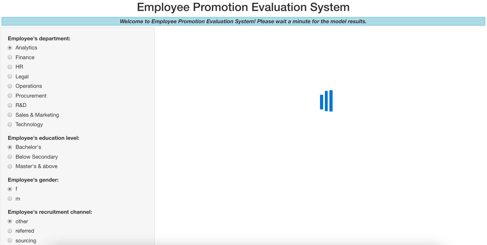
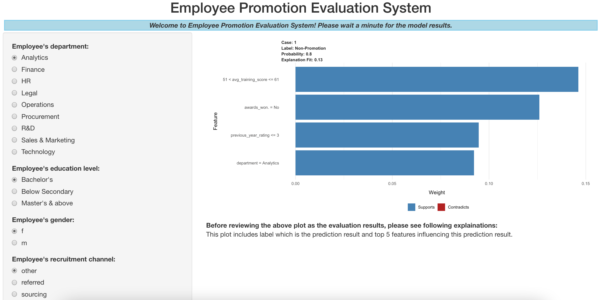

# bios-611-project

Created by **Qiyao Qin** for course BIOS 611 at UNC.

## Introduction 

 Nowadays, **employee promotion** is of great significance for both company and employees, since this will directly impact the efficiency and performance of the organization. One of the greatest challenges in employee promotion is to identify the right person for promotion and prepare him/her in time. This project mainly has two goals:

* To **predict whether a potential candidate at checkpoint in the test set will be promoted or not** after the evaluation process to help company recognize the brilliant employees quickly;
* To **develop a system for employees to see the factors impacting their promotions at any time** to help them know what they should do to improve their career development.

The data set used in this project is about employee promotion from [Kaggle (HR Analytics: Employee Promotion Data)](https://www.kaggle.com/datasets/arashnic/hr-ana). It consists of **13 variables** including **employee_id**, **department**, **region**, **education**, **gender**, **recruitment_channel**, **no_of_trainings**, **age**, **previous_year rating**, **length_of_service**, **awards_won**, **avg_training_score** and **is_promoted**. And is promoted is the target variable. The detailed features’ descriptions are as follows:

1. employee_id: Unique ID for employee
2. department: Department of employee
3. region: Region of employment
4. education: Education Level
5. gender: Gender of Employee
6. recruitment_channel: Channel of recruitment for employee
7. no_of_trainings: Number of other trainings completed in previous year on skills etc.
8. age: Age of Employee
9. previous_year_rating: Employee rating for the previous year
10. length_of_service: Length of service in years
11. awards_won: If awards won during previous year then 1 else 0
12. avg_training score: Average score in current training evaluations
13. is_promoted: If recommended for promotion then 1 else 0

## Plots & Website & Report

### Using docker to make life easier

First run the following command to create suitable docker image. (M1 or M2 Mac isn't able to build this docker container)

```
docker image build -t 611-project .
```

And we can run docker container using the following command.

```
docker run -v $(pwd):/home/rstudio -e PASSWORD=qiyaoqin -p 8787:8787 -p 8080:8080 -t 611-project
```

Then, we need to use the [RStudio Server (http://localhost:8787)](http://localhost:8787) with the username of "rstudio" and the password of "qiyaoqin".

### Using Makefile to generate all the stuff

We can use the following command to clean the previous data and files, then we can run other commands to produce pictures, classification model, shiny website and final report.

```
make clean
```

#### 1. Get the plots of relations between promotion and other variables using the following commands:


```makefile
make visualization
# Or we can use following commands:
make figures/promotion_sex.png
make figures/promotion_department.png
make figures/promotion_education.png
make figures/promotion_recruitment_channel.png
make figures/promotion_awards.png
make figures/promotion_age.png
make figures/promotion_avg_training_score.png
make figures/promotion_previous_year_rating.png
make figures/promotion_no_of_trainings.png
```

**Examples:**


#### 2. Build the random forest model of promotion prediction with importance of variables plot on train data, ROC curve on test data and an example LIME plot using the following command:

```makefile
make figures/randomforest_importance.png 
make figures/roc.png
make figures/lime.png
```

#### 3. Make the final report in pdf format using the following command:

```makefile
make Report.pdf
```

#### 4. Use shiny to build employee promotion evaluation system using following command:

```makefile
make shiny
```

Then you can open the shiny website on [http://localhost:8080](http://localhost:8080).

**Examples:**




